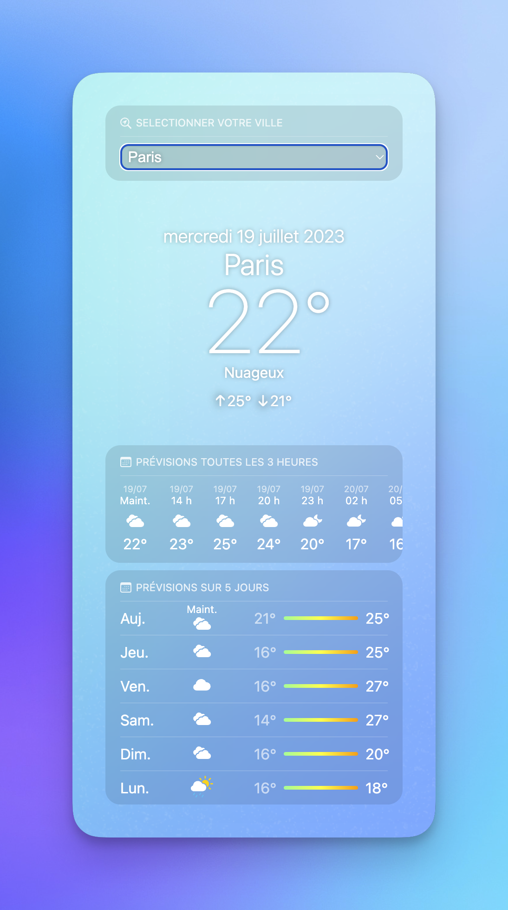

<p align="center">
    <a>
        
    </a>
</p>

<h1 align="center">Weather App Clone <a href="www.apple.com">Apple</a></h1>
<h3 align="center"><i>(Clone Application Météo)</i></h3>

<p align="center">

</p>

<p align="center">
  <p align="center">
      Weather App Clone <a href="www.apple.com">Apple</a> is a clone of the Apple weather application.
</p> 
    <p align="center">.
        <a href="https://github.com/hugo-HDSF/weather_icons_svelte/issues">Report Bug</a>
        .
        
    </p>
</p>

<div align="center">


</div>

<div align="center">


</div>

-----

## Table Of Contents

* [About the Project](#about-the-project)
* [Implementation](#implementation)
* [Built With](#built-with)
* [Getting Started](#getting-started)
    * [Prerequisites](#prerequisites)
* [Roadmap](#roadmap)
* [License](#license)
* [Authors](#authors)
* [Acknowledgements](#acknowledgements)

## About The Project




This App is a clone of the Apple weather application. The objective of this project is to reproduce the interface of the Apple weather application. The data is provided by the [OpenWeatherMap](https://openweathermap.org/) API.
## Implementation

> `🚀 Continuous integration`

## Built With

* [Svelte](https://svelte.dev/)
* [Vite](https://vitejs.dev/)
* [TypeScript](https://www.typescriptlang.org/)
* [PostCSS](https://postcss.org/)
* [JavaScript](https://developer.mozilla.org/fr/docs/Web/JavaScript)
* [HTML5](https://developer.mozilla.org/fr/docs/Web/HTML)
* [CSS3](https://developer.mozilla.org/fr/docs/Web/CSS)
* [OpenWeatherMap](https://openweathermap.org/)


## Getting Started

To get a local copy up and running, follow these simple steps:

### Prerequisites


#### 1. Clone repository

```Shell
git clone https://github.com/hugo-HDSF/weather_icons_svelte.git
cd weather_icons_svelte
```

#### 2. Install dependencies

```Shell
npm install
```

#### 3. Npm setup

- Run the development server:
```bash
npm run dev
```

#### 4. Open your browser and navigate to https://localhost:5173

## Roadmap

Check list of known [open issues](https://github.com/hugo-HDSF/weather_icons_svelte/issues).

## License

Distributed under the MIT License.

## Authors

* **DA SILVA Hugo** - *Student - Fullstack Developer* - [Github](https://github.com/hugo-HDSF/)

## Acknowledgements

* [OpenWeatherMap](https://openweathermap.org/)
* [Img Shields](https://shields.io/)
* [Simple Icons](https://simpleicons.org/)
* [Readme Generator](https://readme.shaankhan.dev/)

###### _Personal Project | 2023